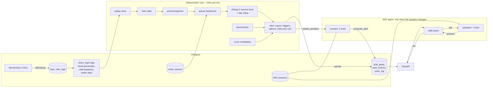

# Shift Readiness Agent

A line manager at a 24/7 support centre has one question at ten to nine: **is my floor staffed at nine, and if not, what do I do about it?**

This is an agent that answers it. It watches every rostered agent's commute, projects floor readiness and service level per queue, and when a threshold breaks it tells the manager who is late, what it costs on the contract, and what to do, with the messages already written.

Built on MoveInSync's anonymised trip-log dataset for the **team / line manager** persona.


## What it does

At 08:55 on 11 June, the board reads:

> Billing Support is four agents short until 09:19. Service level is 15% now, and the day's 80% target still holds. This is tracking towards 5 late, about the usual 5 for this team. Recommend early-shift cover from Agent 27, Agent 29, Agent 35, and Agent 31. If nobody acts, 4 night agents are held 19 min past shift end and 4 would miss the 09:15 cab home.

Every figure in that came from a computation, not from the model. The model chose which facts to lead with and wrote the sentences. Below it are the options as buttons, each scored on service level, with the recommended one in green. Clicking one records the decision, returns a message the manager can forward unedited, and charges the cost to whoever absorbs it.

**Sense.** A replay clock advances over the trip data. Every read is guarded by the clock, so nothing is visible before it happened. Swap the replay for a live event feed and nothing else changes.

**Reason.** Rider state, arrival projection, queue headcount, Erlang C service level, day-level rollup, cause, benchmarks, cover candidates, hold-over cost. All deterministic Python over Postgres. About 15 milliseconds a tick.

**Act.** A Google ADK agent, on an OpenAI model through LiteLLM, receives the computed alert and writes the summary and drafts. The same agent answers the manager's questions. It cannot invent a number or a name because the tools only hand it what was computed.

## Setup

You need Postgres running locally and `uv`.

```bash
# 1. Database
psql -h 127.0.0.1 -U postgres -c "CREATE DATABASE bessemer"
psql -h 127.0.0.1 -U postgres -d bessemer -f db/schema.sql

# 2. Dataset (place the MoveInSync folder in the repo root, then)
uv sync
uv run python -m db.load          # about 90 seconds, 2.3M rows
uv run python -m db.seed_roster   # 24 riders, a cover pool, a night shift

# 3. Model key
echo "OPENAI_API_KEY=sk-..." > agent/.env

# 4. Run
uv run uvicorn app.api:app --port 8000
open http://localhost:8000
```

Config lives in `app/config.py` and is overridable by environment variable. The demo defaults to `pinnacle-Slc`, `Clearwater Campus`, the `09:00` shift, on `2026-06-11`.

```bash
uv run pytest tests/ -m "not live"    # 109 tests, no model calls, ~55s
uv run pytest tests/test_agent.py -m live   # 3 tests against the real model
```

## Live and playback

One slider, one switch.

**Live on.** The clock is real and the model is called fresh every time. Click a checkpoint to run the morning forward to it, watching the clock tick, then watch the agent write the alert word by word in the right-hand panel. Status, clock and text all arrive on one event stream from the server, so the board can never show a stale state. Each write-up is under 45 words and takes five to ten seconds. Everything a live run does is captured minute by minute.

**Live off.** The slider plays back the last live run. Instant, no compute, no model. Press Play to animate through it. If nothing has been recorded yet the panel says so and points at the switch.

Left and right arrow keys step between landmarks in either mode. Clicking an option records the decision at the minute on screen.

## The designed morning

The demo runs on a designed Thursday, 6 August 2026, built in the dataset's own schema by `db/seed_story.py`. The rows are fabricated and say so. The three months of real history still feed every benchmark. Set `BESSEMER_DEMO_DATE=2026-06-11` to run the real day instead.

| Time | What happens | What the agent does |
|---|---|---|
| 07:30 | Quiet. One tech agent on booked leave. | Nothing. No alert, no model call. |
| 08:05 | One vendor's cab has not left. Four billing riders `CAB_LATE`, coverage 67%. | Alert opens, cause `CAB_NOT_STARTED`, vendor named for escalation. Cover not offered: nobody from 08:30 is in yet. |
| 08:30 | Two tech riders' cab came and went without them. Three seats gone on a queue with one agent of headroom. | Cause `ABSENCE`. Call them. Cover offered. The day cannot reach 80%, so operations is flagged as urgent, an hour before the shift starts. |
| 08:55 | 13 of 24 on the floor. Billing 67%, service level 15%, day still holds. | Four priced options. Cover from four named early-shift agents is green. Hold-over costs four night agents their cab home. |
| 09:30 | Billing's cab lands. Tech support is 9 of 12 and stays there. | Billing resolves itself. Tech stays open with the day at 53%, unrecoverable. |

## The demo, in six beats

Switch Live on and click the dots in order.

1. **07:45.** Board green. 24 rostered, nobody due yet.
2. **08:12.** The cab for Agent 20 has not left its depot, 32 minutes late. First amber.
3. **08:25.** Billing Support alert opens at 92% projected coverage. The narrative arrives a few seconds later.
4. **08:47.** Agent 15 not collected, cab has passed. The alert now offers "Call the unaccounted riders".
5. **08:55.** Billing at 67%, service level 15%. Click **Move the early shift onto the queue**. The draft appears under Sent, naming four people who are verifiably on the floor.
6. **09:19.** Billing back to 83%. The alert resolves itself. Ask the chat: *"Who covered this morning, and how much overtime did we avoid?"*

## How it is built



Where the model sits: only in the bottom box, only when an alert opens, resolves, changes cause, changes recommendation, or crosses a severity band. A 150-tick morning across two queues produces about 11 narratives. Everything else is arithmetic.

### The pieces

| Path | What it does |
|---|---|
| `db/schema.sql` | Tables, views and indexes. Views carry the history maths. |
| `db/load.py` | CSV to Postgres via COPY, with every data quirk handled and counted. |
| `db/seed_roster.py` | Picks real riders for the team and cover pool; asserts a synthetic night shift. |
| `app/core/state.py` | Nine-state rider machine. Only reads what `now` reveals. |
| `app/core/eta.py` | Arrival projection with an honest uncertainty band. |
| `app/core/queue.py` | Headcount per queue, impact as a range, service level, day rollup. |
| `app/core/sla.py` | Erlang C, speed of answer, abandonment, adherence, agents needed. |
| `app/core/context.py` | Five benchmarks: team norm, weekday, recent, peer sites, structural slack. |
| `app/core/remediation.py` | Cover candidates verified on the floor; hold-over priced. |
| `app/core/alerts.py` | Triggers, cause, lifecycle with hysteresis, options scored on the contract. |
| `app/replay.py` | The clock. |
| `app/recording.py` | Every live tick captured for playback, landmarks derived from the feed. |
| `db/seed_story.py` | The designed morning, in the dataset's schema. |
| `app/api.py` | Fourteen endpoints, all scoped by tenant, site, date and shift. |
| `agent/` | Tools, two agents, runner, metered usage. |
| `web/index.html` | The board. One file, no build step. |

## What is real and what is synthetic

| Thing | Source |
|---|---|
| Riders, trips, pickup and drop times, no-shows, vendors, cabs | Real. From the dataset. |
| The 24-person team and the 24-person cover pool | Real riders, chosen because they rode the shift 40+ days. |
| Which queue a rider serves, handle time, call forecast, service target | Synthetic. In `roster` and `queues`. |
| The night shift and positional handover | Synthetic, and flagged as such in the roster. Clearwater's trip log has no outbound legs near 09:00, so there was no night shift to read. We assert one because a 24/7 desk is what makes a late arrival cost something beyond a thin queue. |
| Overtime rate, cab-home time, cover fairness counter | Synthetic. In `app/config.py`. |

## Findings worth knowing

Things the data said that changed the design.

**Transport and the floor disagree about what a delay is.** 70% of arrivals that miss the shift start on this route are stamped `NODELAY` by the transport system. By the operator's measure nothing went wrong. The floor is short regardless. The alert senses the floor and never reads that column.

**The plan is inside its own error bar.** The median buffer between planned drop and shift start is 5 minutes. Journey-time noise is about 13 minutes. Half of arrivals are late by construction, and no amount of daily escalation fixes a schedule built that way. This is surfaced as a benchmark.

**Clearwater is the worst site on this shift.** 46% late against 29% across four peer sites. Cedar Ridge runs the same shift at under 1%.

**Staffing is not linear.** Losing four of twelve agents on a properly loaded queue takes service level from 92% to 15%, not to two-thirds. A headcount alone cannot convey that, which is why the service level is computed and shown.

**A twenty-minute gap does not break the day.** The interval collapses; the daily number holds at 92%. The alert says so, and escalates to operations only when the day is genuinely at risk. Telling a manager when not to escalate is worth as much as telling them when to.

## Honest limitations

- **No GPS.** The dataset has pickup and drop times only. Once a rider is aboard, nothing is observable until they arrive, so the projection carries about 13 minutes of irreducible spread. Impact is reported as a range for this reason, and the hard alert trigger is the deterministic "planned drop passed, no arrival", which has no false positives.
- **The projection is calibrated on ordinary days** and reads optimistic on bad ones. This is asserted in a test so nobody mistakes it for a bug.
- **Erlang C assumes** Poisson arrivals, exponential handle times, no abandonment, and interchangeable agents within a queue. Real workforce tools relax all four. The shape of the answer is what the decision depends on.
- **The night shift is invented.** Everything about it is labelled synthetic.

## Data quirks handled

All from the dataset's own README, each counted in the load log.

- `trip_id`, `stwid`, epochs and `delay_minutes` are comma-formatted strings in some files and clean numbers in others. Normalised on load.
- Four different date formats across five files. Parsed per file.
- Negative distances in `emp_data`. Nulled, 48 of them.
- A literal `"False"` in `alerts_data.severity`. Nulled, 15,037 of them.
- Dtype drift across the three monthly ride files. Reconciled on concat.
- `stwid = 0` is a placeholder. Filtered by the views.
- `Non Shift` and `Adhoc` shift labels. Filtered by the views.
- Two cover riders take a second inbound leg on the demo day. A view picks the one nearest their rostered start.
- Nulls are states, not errors: a null pickup and drop together mean the rider never boarded.

## Deployability

Postgres for everything durable, including the agent's sessions. Every table and every endpoint is keyed by `business_unit` and `office`, so pointing this at another tenant is a config change. The reasoning core does no model calls and no per-tick database round trips, which is what makes it credible at enterprise volume. The ADK agent deploys to Cloud Run with one command, and the model behind it is a one-line swap.

The replay is the only piece that would be replaced in production, by a consumer of live trip events. Nothing downstream would notice.
